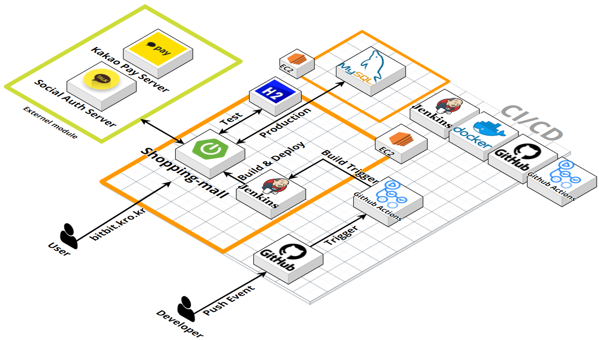

# shopping-mall-spring-boot

## ⚙️ 개발 환경(Development Environment)

| 분류              | 개발환경                                             | 
|-----------------|--------------------------------------------------|
| 운영체제            | Mac OS, Windows                                  |
| 개발도구            | Intellij IDEA, Gradle, Notion, ERDCloud, draw.io |
| 기술 스택           | Java, Spring Boot, MyBatis                       |
| 데이터베이스          | MySQL, H2                                        |
| 버전 관리           | Github, Git                                      |
| 배포 및 운영         | Jenkins, AWS, Docker                             |
| 오픈소스 및 외부 라이브러리 | Bootstrap, Kakao Login API, Kakao Payment API    |

## 🛠 세부 기술 스택(Tech Stack)

### Application

**Back-end**

 

- Oracle JDK 11 [dev, test]
- Open JDK 11 [prod]

 

- Spring Boot 2.7.15
  - Spring Web
  - Spring Validation
  - Spring Data JDBC
  - Spring AOP
- MyBatis 2.3.1
- Spring Cloud 2021.0.4
  - Spring Cloud Open Feign 3.1.4

**Front-end**

- HTML5
- CSS3
- JavaScript
- BootStrap 4
- Jquery 3.3.1
- JSP

### DataBase

 

- MySQL 8.1.0 [dev, prod]
- H2 2.1.214 [test]

### DevOps & Infrastructure

 

- Jenkins 2.414.1
- GitHub Actions
- Docker 24.0.5
- AWS EC2 - Ubuntu 2022.04 amd64 [t2.micro]

### Others

 

- Kakao Login API [v2]
- Kakao Pay API [v2]
- Daum PostCode API [v2]
- Sweet Alert 2

## 서비스 아키텍처

## 기능 명세서

[바로가기](https://www.notion.so/c5cc529cde524a0eacd7433be5466aa4?v=c4f6ef4260724835ba010543be9dbb35&pvs=4)

## ERD & Diagram

[바로가기](https://www.erdcloud.com/d/HnnmsKsQ4Q9ztQy4K)
